# Architecture

```mermaid
flowchart LR
    Clock[n8n or built-in scheduler] -->|private HTTP tick| API[FastAPI service]
    API --> Gmail[Gmail read-only adapter]
    Gmail --> Normalize[Normalize and bound text]
    Normalize --> Rules[Configured deterministic rules]
    Rules --> Minimize[Redact and minimize]
    Minimize -->|selective analysis| AI[No-tool AI adapter]
    AI --> Validate[Strict schema and evidence validation]
    Rules --> Store[(Local SQLite metadata)]
    Validate -->|validated output or rule fallback| Store
    Store --> Digest[Priority and category aggregation]
    Digest --> Render[Escaped HTML and plain text]
    Render --> Receipt[(Durable delivery claim)]
    Receipt --> SMTP[TLS SMTP to fixed owner]
```

Email and AI content are untrusted. Config files and environment secrets are operator-controlled. The backend owns checkpoints, per-message IDs, daily token reservations, job leases, run health, digest snapshots, retention, and delivery receipts. n8n owns only the clock and private HTTP trigger. The backend can run without n8n for local reproducibility.

Gmail pages are fetched with transient retries. Failed messages do not discard successful ones and prevent the high-water checkpoint advancing. Polling overlaps by one hour. SQLite insert-if-absent records prevent duplicate processing within the retention horizon; expired inputs are rejected. SQLite transactions coordinate multiple processes, while durable job leases serialize processing and generation.

Clear rules short-circuit low-value content. Unresolved and relevant messages can use AI; explicitly matched rules can opt in with `analyze`. Sender/domain rules lock category and priority. AI cannot lower deterministic HIGH/URGENT hints. Hosted requests have no tools, use strict JSON output, and are checked locally for configured enums, bounded text, quoted evidence, and grounded deadlines. Any failure returns rule results and a degraded health notice.

Daily digests are snapshots keyed by exact UTC start/end. Local scheduling accounts for DST. SMTP delivery has a persisted claim; ambiguous acceptance stops automatic retries. An operator reconciles delivery using the CLI. Retention removes records, runs, budgets, digest snapshots and old previews. Purge erases all application metadata and resets ingestion.

The HTTP server runs one Uvicorn worker by default. Background scheduling uses a worker thread so the async server remains responsive. The built-in scheduler is optional; production deployments normally choose n8n. A single mailbox and a few hundred emails/day are the intended scale.
