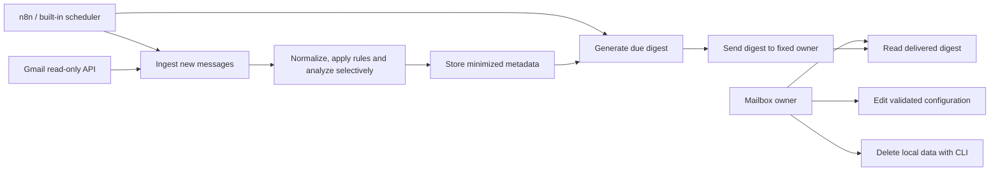

# MVP use cases

Failures in a message or external analysis fall back to independent processing and are surfaced in health counts. A Gmail outage leaves the checkpoint intact and still permits a degraded digest. History metadata can be inspected through `GET /items`; feedback learning, immediate alerts and a history UI remain post-MVP.
